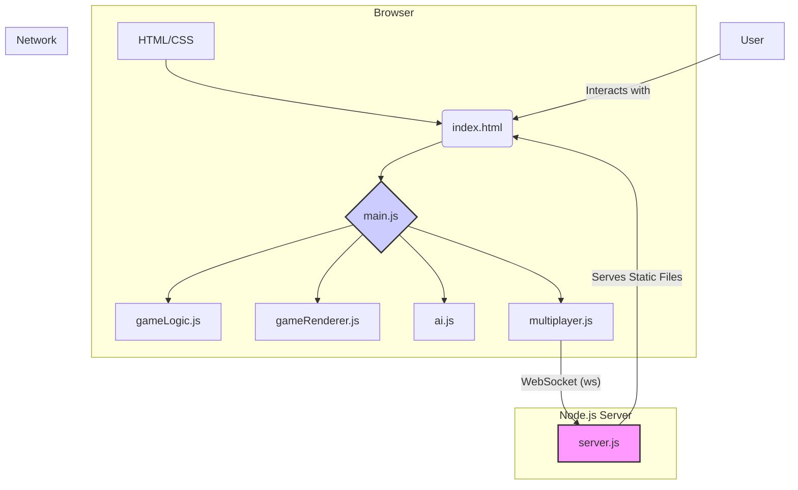
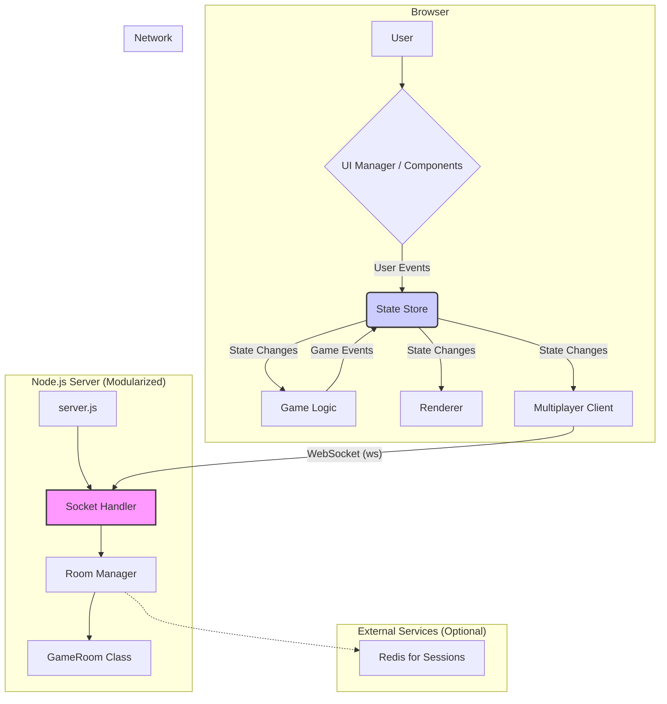

# 项目分析与优化建议

## 1. 当前架构概览

项目采用的是经典的前后端分离架构：

- **前端 (Client)**: 使用原生 JavaScript、CSS 和 HTML 构建的静态页面，负责游戏界面的渲染、用户交互和与后端的实时通信。
- **后端 (Server)**: 一个 Node.js 服务器，使用 Express 处理 HTTP 请求（主要用于提供静态文件），并利用 `ws` 库建立 WebSocket 服务，处理游戏房间管理、玩家匹配和游戏逻辑同步。

下面是当前架构的示意图：

## 2. 优化建议

### (1) 代码结构与可维护性

#### 问题

- **前端逻辑耦合**: [`client/js/main.js`](client/js/main.js:1) 中的 `GameApp` 类承担了过多的职责，包括UI事件绑定、游戏模式切换（单人/联机）、状态管理以及对 `game`, `renderer`, `ai`, `multiplayer` 等多个对象的直接协调。特别是通过猴子补丁（Monkey Patching）的方式重写了 `game.selectPiece` 方法，这使得逻辑变得不直观且难以维护。
- **后端状态管理**: [`server/src/server.js`](server/src/server.js:1) 将所有逻辑都放在一个文件中。虽然目前规模不大，但随着功能增加（如排行榜、断线重连等），这个文件会迅速膨胀，变得难以管理。房间和玩家状态直接使用全局的 `Map` 对象存储，缺乏封装。

#### 建议

- **前端状态管理模式**: 引入简单的状态管理模式或库（例如 Redux 或 MobX 的简化版，甚至一个自定义的 `Store` 对象）。将游戏状态（如 `gameMode`, `currentPlayer`, `gameState`）集中管理，由状态变更来驱动UI更新和逻辑处理，而不是在事件回调中混合各种逻辑。
- **模块化与依赖注入**:
  - 将 `GameApp` 的职责拆分。可以创建一个 `UIManager` 来专门处理DOM事件和模态框。
  - 不要重写 `selectPiece`，而是使用事件监听/发布-订阅模式。例如，当 `game.makeMove` 成功后，`game` 对象可以发布一个 `moveMade` 事件，`GameApp` 或 `MultiplayerClient` 监听到事件后再执行相应的AI或网络操作。
- **后端代码分层**:
  - **`server.js`**: 作为入口，只负责初始化 Express 和 WebSocket 服务器。
  - **`GameRoom.js`**: 将 [`GameRoom`](server/src/server.js:20) 类移至独立文件。
  - **`SocketHandler.js`**: 创建一个新文件来处理所有 WebSocket 的 `connection`, `message`, `close` 事件逻辑，使主文件更清晰。
  - **`RoomManager.js`**: 创建一个类来管理所有房间的生命周期（创建、删除、查找），而不是直接操作全局 `Map`。

### (2) 后端优化

#### 问题

- **ID生成**: [`generateRoomId`](server/src/server.js:99) 和 [`generatePlayerId`](server/src/server.js:103) 使用 `Math.random()`，存在极小概率的碰撞可能，且不够专业。
- **错误处理**: 当前的错误处理比较基本，直接将错误信息发送给客户端，可能会暴露服务器内部细节。
- **可扩展性**: 如果未来希望服务器支持多个实例（负载均衡），当前内存中的房间状态会成为瓶颈。

#### 建议

- **使用专业ID库**: 引入 `uuid` 或 `nanoid` 库来生成唯一ID，确保唯一性。
- **标准化的错误响应**: 定义一套标准的错误码和消息格式。例如 `{ type: 'error', code: 1001, message: 'Room not found' }`，这样客户端可以根据错误码执行特定逻辑。
- **考虑持久化/缓存**: 对于更大型的应用，可以考虑使用 Redis 来存储房间和会话状态。这不仅能解决多实例问题，还能轻松实现断线重连等高级功能。

### (3) 前端优化

#### 问题

- **DOM操作**: [`main.js`](client/js/main.js:1) 中有大量手动的 DOM 元素获取和操作，尤其是在模态框（Modal）部分，代码冗长且容易出错。
- **AI响应**: 使用 `setTimeout` 来触发AI移动，虽然简单，但在复杂的UI交互中可能不够稳定。

#### 建议

- **使用UI模板/组件**: 即使不引入大型框架（如React, Vue），也可以创建一个简单的 `Component` 基类或模板函数来生成和管理DOM元素（如模态框），使UI逻辑更清晰。
- **使用 `requestAnimationFrame`**: 对于游戏渲染，使用 `requestAnimationFrame` 而不是在每次状态改变后手动调用 `render()`，可以获得更平滑的动画效果并优化性能。
- **异步流程管理**: 使用 `async/await` 改造回调函数（`showChoiceModal` 已经做得很好了），可以应用到更多地方，使异步代码更易读。

### (4) 网络通信

#### 问题

- **消息格式**: 当前的消息格式是有效的，但缺乏统一的结构。例如，`move` 消息和 `gameOver` 消息的结构差异较大。
- **无心跳检测**: WebSocket 连接可能会在某些网络环境下（如移动网络切换、NAT超时）静默断开，服务器和客户端都无法感知。

#### 建议

- **统一消息负载**: 定义一个统一的信封结构，例如 `{ type: 'gameMove', payload: { from, to } }` 和 `{ type: 'gameOver', payload: { winner, reason } }`。这使得消息处理更有条理。
- **实现心跳机制**: 定期（如每30秒）由服务器向客户端发送一个 `ping` 消息，客户端收到后立即回复一个 `pong` 消息。如果服务器在一定时间内未收到 `pong`，则认为连接已断开，可以清理该玩家资源。反之亦然。`ws` 库本身就支持此功能。

## 3. 重构后架构建议

基于以上建议，一个更理想的架构可能如下所示：

## 总结

您的斗兽棋项目已经是一个很棒的起点。通过上述优化，您可以使其：

- **更易于维护和扩展**: 清晰的代码结构和模块划分，让添加新功能（如新棋子、聊天、观战）变得简单。
- **更健壮**: 改进的错误处理和心跳机制能提高联机模式的稳定性。
- **性能更佳**: 优化的前端渲染和后端状态管理能提供更流畅的用户体验。

您可以根据项目的优先级和未来的发展方向，选择性地实施这些建议。祝您编码愉快！
